# Data Download and Deletion from Galaxy Australia

This tutorial outlines the process to get your data out of Galaxy and to delete it from Galaxy afterwards.

This tutorial has been developed to assist users to conform to the [Galaxy Australia data retention policy](https://usegalaxy.org.au/static/pages/policy.html)

The policy states that [**Galaxy Australia**](https://usegalaxy.org.au) is primarily an analysis environment and is not designed or maintained for long term data storage. With this in mind, Galaxy Australia has implemented a policy of user disk quotas and data storage times. They are as follows:

| User Category | User Disk Quota | User Data Retention Time |
|---------------|-----------------|----------------------------|
| Registered Australian Research Users* | 600 GB | 90 days from last activity |
| Other registered users | 100 GB | 90 days from last activity |
| Non-registered users | 5 GB | N/A as all data is deleted on browser session expiry |

\* For details please see the [Galaxy Australia data retention policy](https://usegalaxy.org.au/static/pages/policy.html)

The tutorial is designed to show users how to download their data as:

* individual datasets from histories
* collections of datasets or multiple datasets from one history
* an entire history including it's metadata for import into another Galaxy server

It also has instructions and explanation of Galaxy's two step deletion process (delete and then purge) for:

* individual datasets from histories
* entire histories

At the end of this tutorial, the participate should have a greater knowledge of how Galaxy handles data downloads and deletions and be able to successfully download and delete their own data.

This will also allow you to recover your disk quota and allow you to do more and new analyses if you have used it all!

## Downloading data from Galaxy

There are multiple ways of downloading your data from Galaxy, the choice of which method to use depends on the amount of data you wish to download. You can download a single dataset, multiple datasets all the way to entire histories.

### Part 1: Download a dataset

The easiest way to get your data is to download a single dataset from a history.

| **Download a single dataset** ||
|-----------|------------------------------------------------------|
| A history | 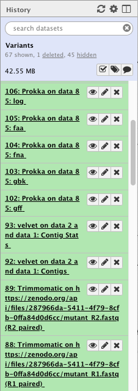 |
| 1. In the History pane, Click on the name of the file you wish to download. This will expand the filename to show some details about the file. | 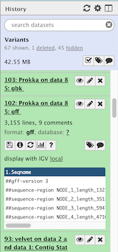 |
| 2. Click the **Download button**. The dataset will now be downloaded to your computer | 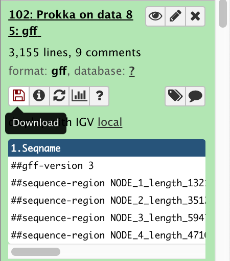 |

Repeat this for any other data file you want in this or other histories.

### Part 2: Download multiple datasets

Sometimes you may want to download multiple histories at once and doing them one by one can be a pain. Luckily, Galaxy has a mechanism for creating *Collections*. For more details about collections and how to create them, see [this tutorial](https://galaxyproject.github.io/training-material/topics/galaxy-data-manipulation/tutorials/collections/tutorial.html) from the Galaxy Training Network.

The concept is very simple however, we are just going to lump together our files of interest and download them all at once.
<table>
    <tr>
        <th style="width=33%">**Download multiple datasets**<th style="width=33%"><th style="width=33%">
    </tr>
    <tr>
        <td colspan=2>**Create a collection of the files you want.** - Click on the **Collections** button at the top of the history pane (the little checkbox)
        <td>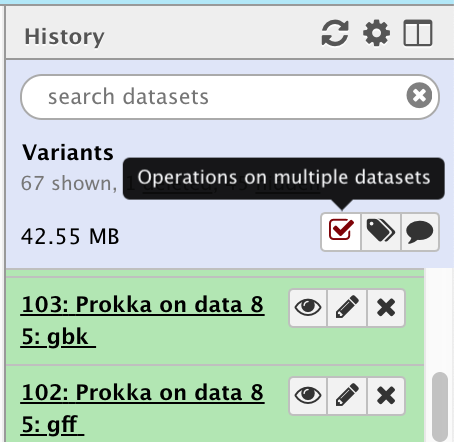
    </tr>
    <tr>
        <td colspan=2>- This creates some new history pane items: A checkbox next to each file name and some new menu buttons.
        <td>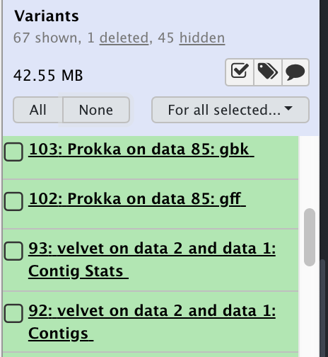
    </tr>
    <tr>
        <td colspan=2>- Now just select the files you want by clicking on their checkboxes, you can also select them all or select none of them.
        <td>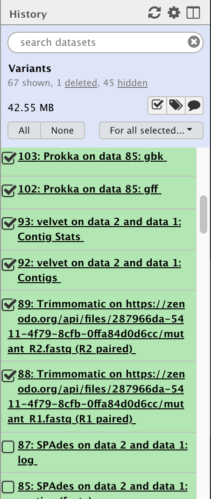
    </tr>
    <tr>
        <td colspan=3>- Once you have selected everything you want, click the **for all selected** button and then click **Build Dataset List**
    </tr>
</table>
<table>
    <tr>
        <td>- A new interface opens showing you the files you have selected.
        <td colspan=2> 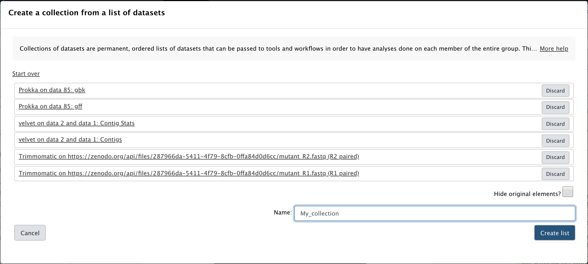
    </tr>
</table>
<table>
    <tr>
        <td colspan=3>Give the list a name in the appropraite box and click **Create**
    </tr>
    <tr>
        <td colspan=2>- Click on the **Collections** button again (the little checkbox at the top of the history pane) to close the interface and go back to the normal history view.
        <td rowspan=2>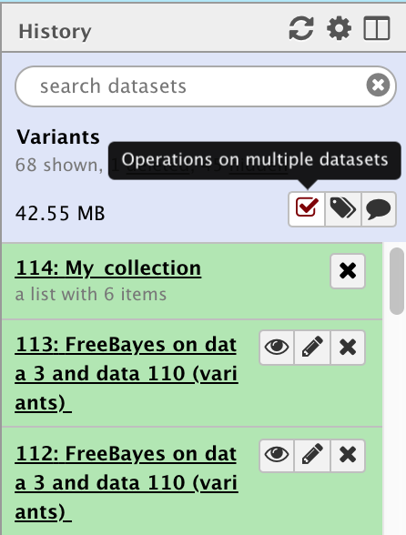
    </tr>
    <tr>
        <td colspan=2>- You will now have a new item in your history, a *collection* of other files.
    </tr>
    <tr>
        <td colspan=2>**Download the collection**  - Click on the collection name in the history pane to expand it
        <td>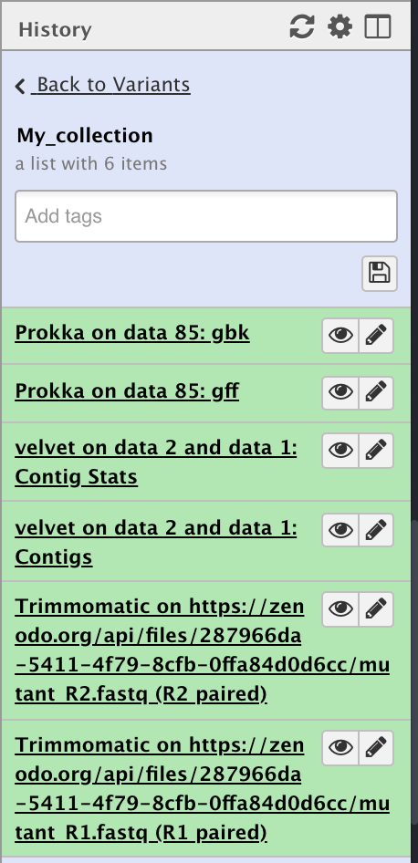
    </tr>
    <tr>
        <td colspan=2>- Click on the **Download Collection** button to download the collection of files as a compressed archive to your computer.
        <td>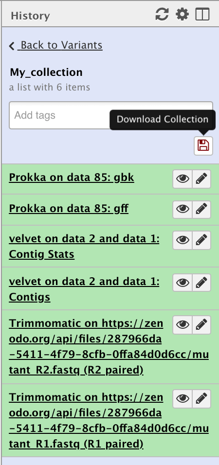
    </tr>
</table>

That's it. You can now repeat the process for other files you want to download in other histories.

### Part 3: Downloading/exporting an entire history

The third way to download data from Galaxy is by *Exporting* a history in it's entirety. This will allow you to download all of the data in a history as well as all of the metadata associated with it such as the tools used, their versions, the parameters chosen etc. It is downloaded as a single file archive. Once downloaded, you can also *Import* this history into another Galaxy server.

Depending on the size of the files and the complexity of the history, it can take quite some time to create the archive before download. For example it can take over 24 hours to create an archive file of a 50GB history. It may be simpler just to download the individual files of interest as outlined above.
<table>
    <tr>
        <th style="width:66%">**Exporting a history**<th style="width:33%">
    </tr>    
    <tr>
        <td>- On the history pane, click on the **history menu** (the cog wheel), then select **Export History to File**
        <td>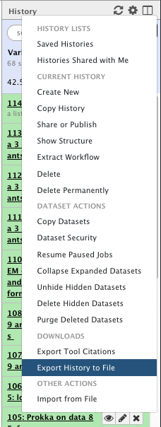
    </tr>
</table>
<table>
    <tr>
        <td>- Galaxy will now start archiving the history and making it available for download. In the main Galaxy pane, a message will appear with a download URL. Once the history has been completely archived, the URL can be used to download the history archive file.
    </tr>
    <tr>
        <td>
    </tr>
    <tr>
        <td>- Click on the URL to start the download. If it isn't ready yet, it will show you the following message. - You will need to save the URL and try again later.
    </tr>
    <tr>
        <td>
    </tr>
</table>

As a guide to how long it can take to produce the archive for downloading:

| History size | Time to archive |
|--------------|-----------------|
| 1 - 200 MB   | A few minutes   |
| 1 - 2 GB     | 1 - 2 hours     |
| >50 GB       | multiple days   |

---

## Deleting data from Galaxy

Once you have downloaded everything that you want to keep from your Galaxy account, we strongly encourage you to delete your no longer required histories.

Deletion in Galaxy is a two stage process. If you delete something, it actually only gets *marked as deleted* and then is hidden. To actually delete an object you must *purge* it from disk. The instructions for how to delete datasets and histories follow.

### Part 1: Deleting a single dataset

This section will show you how to **delete** and then **purge** a single dataset from a history. You can also delete multiple datasets and then purge them all at once.
<table>
    <tr>
        <th style="width:66%">**Delete a single dataset**<th style="width:33%">
    </tr>
    <tr>
        <td>- Click on the **Delete** button on the dataset you wish to delete
        <td>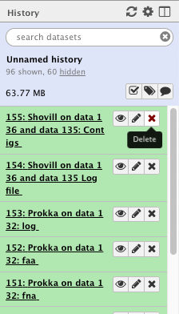
    </tr>
    <tr>
        <td>- The dataset has now disappeared from the history pane and there is a `1 deleted` link at the top.
        <td>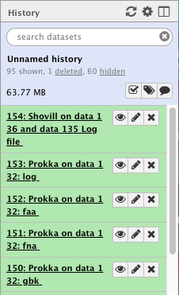
    </tr>
    <tr>
        <td>- You can see the dataset by clicking on the `1 deleted` link at the top of the history pane. - This will allow you to either: *Undelete it* OR *Permanently remove it from disk* by clicking on the appropriate link.  **Note: Once you click on the *permanently remove it from disk* link you CANNOT undo it.**
        <td>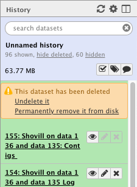
    </tr>
    <tr>
        <td>You can also delete and purge multiple datasets at a time by clicking on the **delete** button on all the datasets you want to remove and then purge them all at once by going to the history menu (the little cog wheel) and selecting **Purge Deleted Datasets**
        <td>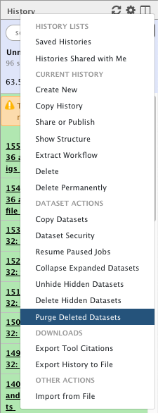
    </tr>
</table>

### Part 2: Deleting an entire history

You can delete an entire history and purge it from disk by doing the following:
<table>
    <tr>
        <th>**Delete an entire history**<th>
    </tr>
    <tr>
        <td>- Open the **Saved Histories** display by clicking on the history menu (little cog wheel) and selecting **Saved Histories**
        <td>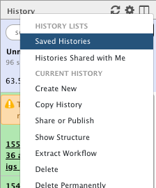
    </tr>
    <tr>
        <td colspan=2>- You will now see a list of all of your histories
    </tr>
    <tr>
        <td colspan=2>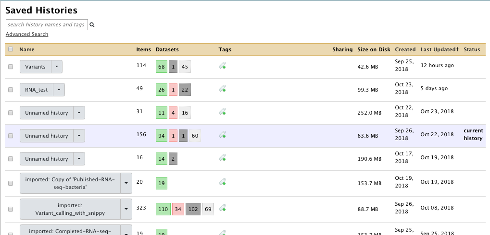
    </tr>
    <tr>
        <td>- You can now delete a history by clicking on the grey button with it's name near or on the little down arrow. - Another little menu will appear. - Select **Delete Permanently** **Note: This will permanently remove the entire history and all of its non shared datasets from disk. It CANNOT be undone.**
        <td>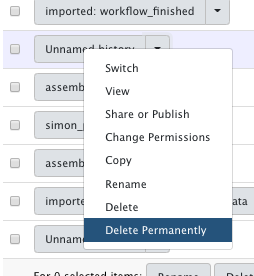
    </tr>
</table>

Your history has now been deleted and purged from disk.
