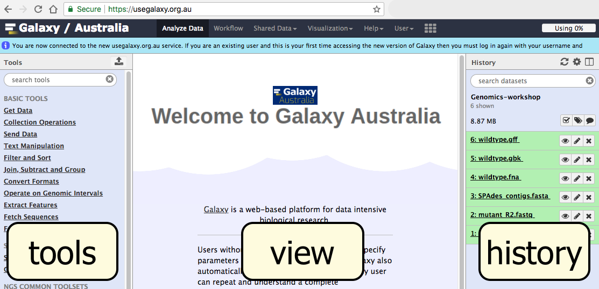
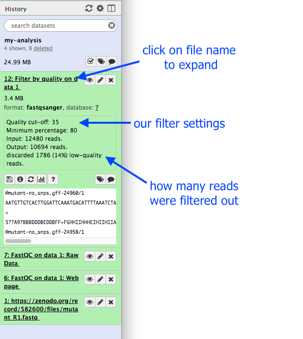
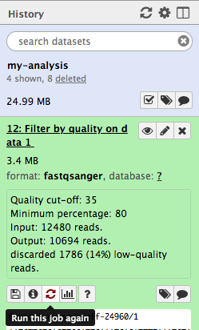
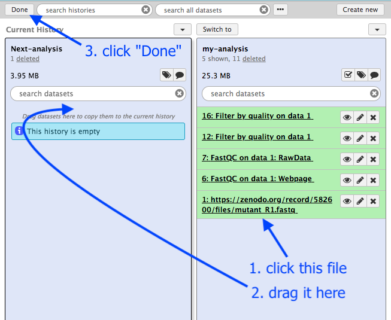

# Learn key tasks

* This is a short introduction to the Galaxy user interface - the web page that you interact with.
* We will cover key tasks in Galaxy: uploading files, using tools, and viewing histories.

<fn>**New to Galaxy?** First try the [introduction](../galaxy/index.md)</fn>

## What does Galaxy look like?

* Browse to your Galaxy instance and log in or register.
    * Use Chrome, Safari or Firefox as your browser, not Internet Explorer.
    * This is an image of Galaxy Australia, located at [www.usegalaxy.org.au](https://usegalaxy.org.au/).

* The particular Galaxy server that you are using may look slightly different and have a different web address.
    * For example, the main Galaxy server is [www.usegalaxy.org](https://usegalaxy.org/).

* The Galaxy page is divided into three panels:
    * Tools on the left
    * Viewing panel in the middle
    * History of analysis and files on the right

* The first time you use Galaxy, there will be no files in your history panel.

## Name your current history

Your "History" is in the panel at the right.

* Go to the History panel
* Click on the history name ("Unnamed history")
* Type in a new name, for example, <fn>My-Analysis</fn>
* Press Enter
 

## Upload a file

Your "Tools" are in the panel at the left.

* Go to the Tools panel
* Click <ss>Get Data</ss> (at the top of the list)
* Click <ss>Upload File</ss>

This brings up a box:
 

 

* Click <ss>Paste/Fetch data</ss>
* Paste in the address of a file: *https://zenodo.org/record/582600/files/mutant_R1.fastq*
* Then click <ss>Start</ss>.
* Then click <ss>Close</ss>.
Your uploaded file is now in your current history.

When the file has uploaded to Galaxy, it will turn green.

* Grey means "waiting to run"; yellow means "in progress".

What is this file?

* Click on the eye icon next to the file name, to look at the file contents.

The contents of the file will be displayed in the centre Galaxy panel.

* This file contains DNA sequencing reads from a bacteria, in FASTQ format:

[Click here for more information about FASTQ format.](https://en.wikipedia.org/wiki/FASTQ_format)

## Use a tool

Let's look at the quality of the reads in this file.

* In the tools panel search box, type in "FastQC".
* Click on the tool <ss>FastQC</ss>
* This brings up a window in the centre of the screen.
* For <ss>Short read data from your current history</ss> select the FASTQ file that we uploaded.
* Leave the other parameters as they are.
* Click <ss>Execute</ss>.
* This tool will run and the two output files will appear at the top of your history panel.

How do I choose the correct parameters for my analysis?

* Under the tool interface panel in Galaxy there will usually be a description of the tool function and options, and a link to the tool's documentation.
* When trying a tool, you can usually use most of the default settings, as these are typically (generally) appropriate.
* When doing your own analyses, it is definitely recommended that you read about the tool parameters in more detail in the documentation, and adjust to your data and analysis accordingly.

## View results

We will look at the output file called <fn>FastQC on data 1: Webpage</fn>.

* Note that Galaxy has given this file a name according to both the tool (FastQC) and the data file ("data 1") that it used.
* The name "data 1" means the data file (our FASTQ file) which was file number 1 in Galaxy's current history.

* Click on the eye icon next to the output file.
* The information is displayed in the centre panel.

This tool has summarised information about all of the reads in our FASTQ file.

* What was the length of the reads in the input FASTQ file?
* Do these reads have higher quality scores in the centre or at the ends?

## Optional: Run another tool

Let's run a tool to filter out lower-quality reads from our FASTQ file.

* In the tool panel search box, type in "Filter by quality".
* Click on the tool <ss>Filter by quality</ss>
* Under <ss>Library to filter</ss>, Galaxy will probably have found your input FASTQ file. If not, select this file in the drop-down box.
* Under <ss>Quality cut-off value</ss>, type in 35.
* Under <ss>Percent of bases in sequence that must have quality equal to / higher than cut-off value</ss>, type in 80.
* Click <ss>Execute</ss>.

After the tool has run, the output file will appear at the top of your History panel.

* This file will be called <fn>Filter by quality on data 1</fn>.
* Remember that Galaxy has named this file according to the tool it used ("Filter by quality") and the data file ("data 1").
* The actual numbers in front of the files in the history are not important.

What are the results from this filtering tool?

* We could click on the eye icon to view the contents of this output file, but it will not be very informative - we will just see a list of reads.
* Instead, let's click on the output file name in the History panel. This expands the information about the file.
* We can see that 1786 low-quality reads were discarded.

## Optional: Re-run that tool with changed settings

We have now decided that our input reads have to be filtered to an even higher standard.

* We will change the filter settings and re-run the tool.

* In the History panel, find the output file from the first time we ran the filter tool.
* This file is called <fn>Filter by quality on data 1</fn>.
* Click on the icon with two arrows - this means "run this tool again".
 

* This brings up the tool interface in the centre panel.
* Change the settings to something even stricter. For example, you might decide you want 80 percent of bases to have a quality of 36 or higher, instead of 35.
* Click <ss>Execute</ss>.

View the results:

*  Click on the output file name to expand the information. (*Note*: not the eye icon.)
* How many reads were discarded under these new filtering conditions?

You can re-run a tool many times with different settings.

* Each time you re-run the tool, the new output file will appear at the top of your current history.

## Create a new history

Let's create a new history.

* In the History panel, click on the cog icon.
 

 
* Select <ss>Create New</ss>.
* Name your history, *e.g.* <fn>Next-analysis</fn>
* Press Enter

This new history does not have any files in it yet.

## Look at all your histories

Where is your first history, called <fn>my-analysis</fn>?

* In the History panel, click on the "View all histories" icon.
 

 
* All your histories are displayed here.
 

Drag a file into your new history:

* Click on the FASTQ file in <fn>my-analysis</fn> history
* Drag it into the <fn>Next-analysis</fn> history
* This makes a copy of the file in the new history
* Click <ss>Done</ss>, or, if that button is not showing, click <ss>Analyze Data</ss> in the menu panel across the top.

 

Your main Galaxy window will now show the current history as <fn>Next-analysis</fN>, and it will have one file in it.

You can go back into the "View all histories" page and "Switch to" a different history.

## Help! Where am I?

If you find yourself lost, go back to the main Galaxy page by clicking in the top left-hand corner on "Galaxy / Australia":

## Summary

What have we learned?

* The Galaxy interface has tools on the left, viewing pane in the middle, and a history of your data analysis on the right.
* You can create a new history for each analysis. All your histories are saved.
* To get data into Galaxy, you can upload a file by pasting in a web address. There are other ways to get data into Galaxy (not covered in this tutorial): you can upload a file from your computer, and you can import an entire history.
* Choose a tool and change any settings for your analysis.
* Run the tool. The output files will be saved at the top of your history.
* View the output files by clicking on the eye icon.
* View all your histories and move files between them. Switch to a different history.
* Log out of your Galaxy server. When you log back in (to the same server), your histories will all be there.

## Conclusion

Well done! You have completed the short introduction to Galaxy, where you named the history, uploaded a file, used a tool, and viewed results. Additional tutorials are available for a more in-depth introduction to Galaxy's features.

## See this history in Galaxy

If you want to see this Galaxy history without performing the steps above:

* Log in to Galaxy Australia: [https://usegalaxy.org.au/](https://usegalaxy.org.au/)
* Go to <ss>Shared Data</ss>
* Click <ss>Histories</ss>
* Click <fn>Completed-key-tasks-analysis</fn>
* Click <ss>Import</ss> (at the top right corner)
* The analysis should now be showing as your current history.

## What's next?
To use the tutorials on this website:

* &#8592; see the list in the left hand panel
* &#8598; or, click the **menu button** (three horizontal bars) in the top left of the page

You can find more tutorials at the Galaxy Training Network:

* [http://galaxyproject.github.io/training-material/](http://galaxyproject.github.io/training-material/)  
