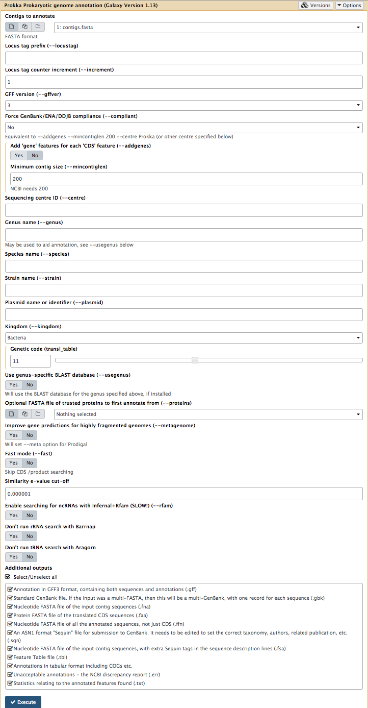
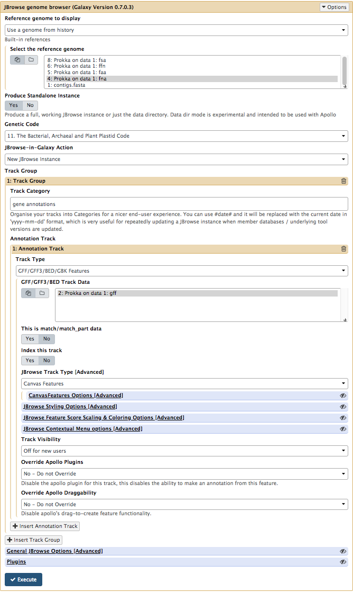
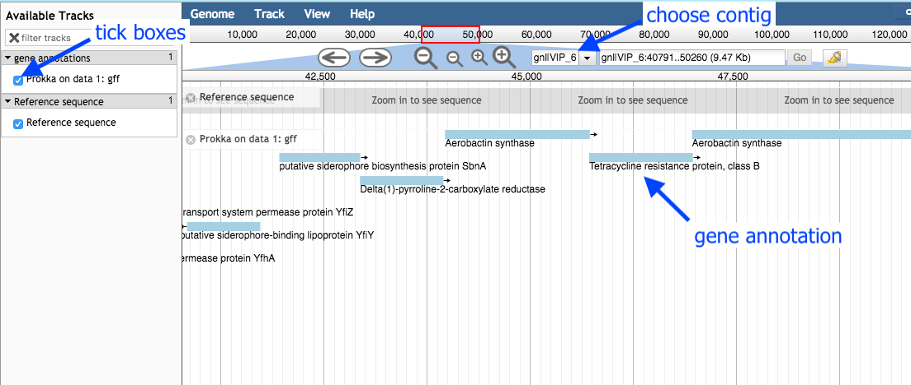

# Genome annotation using Prokka

## Background

In this section we will use a software tool called Prokka to annotate a draft genome sequence.

* Prokka is a “wrapper”; it collects together several pieces of software (from various authors), and so avoids “re-inventing the wheel”.
* Prokka finds and annotates features (both protein coding regions and RNA genes, i.e. tRNA, rRNA) present on on a sequence.
* Note, Prokka uses a two-step process for the annotation of protein coding regions: first, protein coding regions on the genome are identified using [Prodigal](http://prodigal.ornl.gov/); second, the *function* of the encoded protein is predicted by similarity to proteins in one of many protein or protein domain databases.
* Prokka is a software tool that can be used to annotate bacterial, archaeal and viral genomes quickly, generating standard output files in GenBank, EMBL and gff formats.
* More information about Prokka can be found [here](https://github.com/tseemann/prokka).

<fn>**New to Galaxy?** First try the [introduction](../galaxy/index.md) and then learn some [key tasks](../intro/index.md)</fn>

## Input data

* Log in to your Galaxy instance (for example, Galaxy Australia, [usegalaxy.org.au](https://usegalaxy.org.au/)).

Prokka requires assembled contigs.

- *If you are continuing on from the previous workshop ([Assembly with Spades](/modules/spades/index.md)), this file will be in your current history named something like <fn>SPAdes contigs(fasta)</fn>.*

* Or, to upload a file of contigs:

### Use shared data

If you are using Galaxy Australia, you can import the data from a shared data library.

In the top menu bar, go to <ss>Shared Data</ss>.

* Click on <ss>Data Libraries</ss>.
* Click on <fn>Galaxy Australia Training Material: Annotation: Microbial Annotation</fn>.
* Tick the box next to the file.
* Click the <ss>To History</ss> button, select *As Datasets*.
* Name a new history and click <ss>Import</ss>.
* In the top menu bar, click <ss>Analyze Data</ss>.
* You should now have one file in your current history.

### Or, import from the web

*Only follow this step if unable to load the data files from shared data, as described above*.

* In a new browser tab, go to this webpage:

* Find the file called <fn>contigs.fasta</fn>
* Right click on file name: select "copy link address"
* In Galaxy, go to <ss>Get Data</ss> and then Upload File
* Click <ss>Paste/Fetch data</ss>
* A box will appear: paste in link address
* Click <ss>Start</ss>
* Click <ss>Close</ss>
* The file will now appear in the top of your history panel. When uploaded, the file name will turn green.

<!--
We will import a history from Galaxy:

- In the menu options across the top, go to <ss>Shared Data</ss>.
- Click on <ss>Histories</ss>.
- A list of published histories should appear. Click on <fn>GCC 2016 small genome annotation</fn>.
- Click on <ss>Import history</ss>.
- An option will appear to re-name the history. We don't need to rename it, so click <ss>Import</ss>.
- The history will now appear in your Current History pane, and the <fn>SPAdes_contigs.fasta</fn> file is now ready to use in Galaxy analyses.
-->

### Shorten file name

* Click on the pencil icon next to the file name.
* In the centre Galaxy panel, click in the box under <ss>Name</ss>
* Shorten the file name.
* Then click <ss>Save</ss>

## Run Prokka

* Go to the Tool panel and search for "prokka" in the search box.
* Click on <ss>Prokka</ss>

* For <ss>Contigs to annotate</ss>: your <fn>contigs.fasta</fn> file
* All the other settings can be left as they are.

Your tool interface should look like this:

- Click <ss>Execute</ss>

### How do I choose settings when running a tool?

* In this case, the default settings are appropriate for our data set and analysis.
* Under the tool interface in Galaxy there will usually be a more detailed description of the tool options, and a link to the tool's documentation.
* It is recommended that you read about the tool parameters in more detail in the documentation, and adjust to your data and analysis accordingly.  

### Examine the output

<!-- First, enable *Scratchbook* in Galaxy - this allows you to view several windows simultaneously. Click on the 3&times;3 squares icon on the menu bar:

-->

Once Prokka has finished, examine each of its output files.

- The <fn>GFF</fn> and <fn>GBK</fn> files contain all of the information about the features annotated (in different formats.)
- The <fn>.txt</fn> file contains a summary of the number of features annotated.
- The <fn>.faa</fn> file contains the protein sequences of the genes annotated.
- The <fn>.ffn</fn> file contains the nucleotide sequences of the genes annotated.

## View annotated features in JBrowse

Now that we have annotated the draft genome sequence, we would like to view the sequence in the JBrowse genome viewer.

- Go to the Galaxy tool panel, and use the top search box to search for "JBrowse".
- Click <ss>JBrowse</ss>

Leave most settings as they are, except for:

- Under <ss>Reference genome to display</ss> choose *Use a genome from history*.

- Under <ss>Select the reference genome</ss> choose <fn>Prokka on data XX:fna</fn>. This .fna sequence is the fasta nucleotide sequence, and will be the reference against which annotations are displayed.

<!-- - For <ss>Produce a Standalone Instance</ss> select *Yes*. (The "Yes" box will be a darker grey when selected.)
-->

- For <ss>Genetic Code</ss> choose *11: The Bacterial, Archaeal and Plant Plastid Code*.

<!--
- Under <ss>JBrowse-in-Galaxy Action</ss> choose *New JBrowse Instance*. -->

- Click <ss>Insert Track Group</ss>

- Under <ss>Track Category</ss> type in *gene annotations*.

- Click <ss>Insert Annotation Track</ss>

- For <ss>Track Type</ss> choose *GFF/GFF3/BED/GBK Features*

- For <ss>GFF/GFF3/BED Track Data</ss> select <fn>Prokka on data XX:gff</fn>  [Note: not wildtype.gff]

<!--
- Under <ss>JBrowse Track Type[Advanced]</ss> select *Canvas Features*.

- Click on <ss>JBrowse Styling Options <Advanced]</ss>

- Under <ss>JBrowse style.label</ss> check that it says *product,name,id*.

- Under <ss>Track Visibility</ss> choose *On for new users*.
-->

Your tool interface should look like this:

<!--
 -->

- Click <ss>Execute</ss>

### JBrowse output

A new file will be created, called <fn>JBrowse on data XX and data XX - Complete</fn>.

* In place of "XX", there will be numbers that will refer to the files that Galaxy used in your particular history.

Click on the eye icon next to the file name. The JBrowse window will appear in the centre Galaxy panel.

- Under <ss>Available Tracks</ss> on the left, tick the box for <fn>Prokka on data XX:gff</fn>.

- Select a contig to view, in the drop down box. You can only see one contig displayed at a time. Choose the longest contig.

- Use the plus and minus buttons to zoom in and out, and the arrows to move left or right (or click and drag within the window to move left or right).

- Zoom in to see the reference sequence at the top. JBrowse displays the sequence and a 6-frame amino acid translation.

Zoomed in view:

- Right click on a gene/feature annotation (the bars on the annotation track), then select <ss>View Details</ss> to see more information.
    - gene name
    - product name
    - you can download the FASTA sequence by clicking on the disk icon.

<!-- ## What next?

- Identify genome variants (nucletotide changes) using [Snippy](/modules/snippy/index.md).
-->

## Extension exercise

* Open the JBrowse file that you created to show the gene annotations.
* In the drop-down box, select the longest contig.
* Find an annotation for a "hypothetical protein".
    * Alternatively, in the coordinates box, enter "32,500".
    * Zoom out; see the annotation that spans this location. It is a "hypothetical protein".
* Click on this annotation. See the nucleotide sequence: select and copy.
* Go to the [NCBI page](https://blast.ncbi.nlm.nih.gov/Blast.cgi) and BLAST this sequence to see what it matches.
* Try the "blastx" option, which will translate your nucleotide sequence into a protein sequence.
* For <ss>Enter Query Sequence</ss>, paste your sequence into the box.
* For <ss>Genetic Code</ss> choose "Bacteria and Archaea".
* For <ss>Database</ss>, try the "SwissProt" database. You can also re-try with other options to see how the database affects the results.
* All other options can be left as default. Click <ss>BLAST</ss>.
* What does your sequence match?
* In our example, the top hit is to a carboxylase enzyme.
* In the <ss>Show Conserved Domains</ss> window, we can see that this is part of a superfamily of metallo-dependent hydrolases. Click through to find out more about this superfamily.  
* Genome annotation is constantly refined. We can see here that some manual investigation gave us more information about an annotation. This would need to be experimentally confirmed.
* For a detailed description of the BLAST output, see the top right corner of the page and click "Blast report description".

## See this history in Galaxy

If you want to see this Galaxy history without performing the steps above:

* Log in to Galaxy Australia: [https://usegalaxy.org.au/](https://usegalaxy.org.au/)
* Go to <ss>Shared Data</ss>
* Click <ss>Histories</ss>
* Click <fn>Completed-annotation-analysis</fn>
* Click <ss>Import</ss> (at the top right corner)
* The analysis should now be showing as your current history.

## What's next?

To use the tutorials on this website:

* &#8592; see the list in the left hand panel
* &#8598; or, click the **menu button** (three horizontal bars) in the top left of the page

You can find more tutorials at the Galaxy Training Network:

* [http://galaxyproject.github.io/training-material/](http://galaxyproject.github.io/training-material/)
