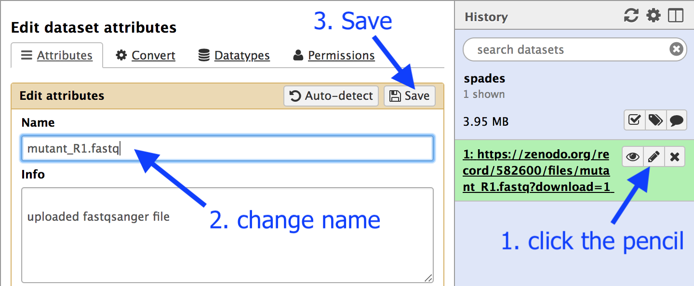
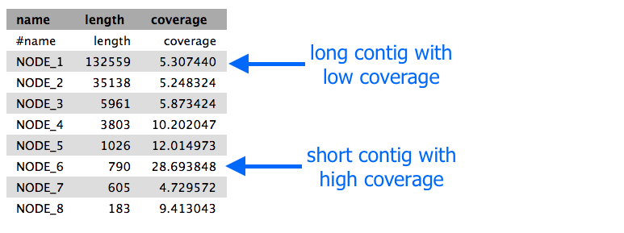

# Assembly using Spades

Spades is one of a number of *de novo* assemblers that use short read sets as input (e.g. Illumina Reads), and the assembly method is based on de Bruijn graphs.

* For information about Spades see this [link](http://bioinf.spbau.ru/spades).

<fn>**New to Galaxy?** First try the [introduction](../galaxy/index.md) and then learn some [key tasks](../intro/index.md)</fn>

## The data

The read set for today is from an imaginary *Staphylococcus aureus* bacterium with a miniature genome.

- The whole genome shotgun method used to sequence our mutant strain read set was produced on an Illumina DNA sequencing instrument.
- The files we need for assembly are the <fn>mutant_R1.fastq</fn> and <fn>mutant_R2.fastq</fn>.
- The reads are paired-end.
- Each read is 150 bases long. <!--(before trimming)-->
- The number of bases sequenced is equivalent to 19x the genome sequence of the wildtype strain. (Read coverage 19x - rather low!).

## Import the data

* Log in to your Galaxy instance (for example, Galaxy Australia, [usegalaxy.org.au](https://usegalaxy.org.au/)).
* Create a new history for this analysis.
* In a new browser tab, go to this webpage:

* Find the file called <fn>mutant_R1.fastq</fn>
* Right click on file name: select "copy link address"
* In Galaxy, go to <ss>Get Data</ss> and then Upload File
* Click <ss>Paste/Fetch data</ss>
* A box will appear: paste in link address
* Click <ss>Start</ss>
* Click <ss>Close</ss>
* The file will now appear in the top of your history panel.

The file name is quite long: let's change it:

* Click on the pencil icon next to the file name.
* In the centre Galaxy panel, click in the box under <ss>Name</ss>
* Shorten the file name to <fn>mutant_R1.fastq</s>
* Then click <ss>Save</ss>

Repeat these steps for the other set of reads (reverse reads) called <fn>mutant_R2.fq</fn>:

* In a new browser tab, go to this webpage: *http://doi.org/10.5281/zenodo.582600*
* Find the file called <fn>mutant_R2.fastq</fn>
* Right click on file name: select "copy link address"
* In Galaxy, go to <ss>Get Data</ss> and then Upload File
* Click <ss>Paste/Fetch data</ss>
* A box will appear: paste in link address
* Click <ss>Start</ss>
* Click <ss>Close</ss>
* The file will now appear in the top of your history panel.

<!--
- <fn>wildtype.fna</fn>: the reference genome sequence of the wildtype strain in fasta format (a header line, then the nucleotide sequence of the genome)

- <fn>wildtype.gff</fn>: the reference genome sequence of the wildtype strain in general feature format (a list of features - one feature per line, then the nucleotide sequence of the genome).

- <fn>wildtype.gbk</fn>: the reference genome sequence in genbank format.
-->

We now have two FASTQ read files in our history.

* Click on the eye icon next to one of the FASTQ sequence files.
* View the file in the centre Galaxy panel.

<!--
- The gff file should look like this:
- Brief Discussion about the GFF format (FIXME: add)

## Evaluate the input reads

Questions you might ask about your input reads include:

- How good is my read set?
- Do I need to ask for a new sequencing run?  
- Is it suitable for the analysis I need to do?

We will evaluate the input reads using the FastQC tool.

- This runs a standard series of tests on your read set and returns a relatively easy-to-interpret report.
- We will use the FastQC tool in Galaxy to evaluate the quality of one of our FASTQ files.
- Go to <ss>Tools &rarr; NGS:Analysis &rarr; NGS: QC and Manipulation &rarr; FastQC</ss>
- Select <fn>mutant_R1.fastq</fn>
- <ss>Execute</ss>
- Once finished, examine the output called <fn>FastQC on data1:webpage</fn> (Hint:). It has a summary at the top of
the page and a number of graphs.

Some of the important outputs of FastQC for our purposes are:

-   <ss>Basic Statistics: Sequence length</ss>: will be important in setting maximum k-mer size value for assembly
-   <ss>Basic Statistics: Encoding</ss>: Quality encoding type: important for quality trimming software
-   <ss>Basic Statistics: % GC</ss>: high GC organisms don’t tend to assemble well and may have an uneven read coverage distribution.
-   <ss>Basic Statistics: Total sequences</ss>: Total number of reads: gives you an idea of coverage.
-   <ss>Per base sequence quality</ss>: Dips in quality near the beginning, middle or end of the reads: determines possible trimming/cleanup methods and parameters and may indicate technical problems with the sequencing process/machine run.
-   <ss>Per base N content</ss>: Presence of large numbers of Ns in reads: may point to poor quality sequencing run. You would need to trim these reads to remove Ns.
-   <ss>Kmer content</ss>: Presence of highly recurring k-mers: may point to contamination of reads with barcodes or adapter sequences.

Although we have warnings for two outputs (per base sequence content; Kmer content), we can ignore these for now. For a fuller discussion of FastQC outputs and warnings, see the [FastQC website link](http://www.bioinformatics.babraham.ac.uk/projects/fastqc/), including the section on each of the output [reports](http://www.bioinformatics.babraham.ac.uk/projects/fastqc/Help/3%20Analysis%20Modules/), and examples of ["good"](http://www.bioinformatics.babraham.ac.uk/projects/fastqc/good_sequence_short_fastqc.html) and ["bad"](http://www.bioinformatics.babraham.ac.uk/projects/fastqc/bad_sequence_fastqc.html) Illumina data. We won’t be doing anything to these data to clean it up as there isn’t much need. Therefore we will get on with the assembly!

-->

## Assemble the reads

We will perform a *de novo* assembly of the mutant FASTQ reads into long contiguous sequences (in FASTA format.)

* Go to the Tool panel and search for "spades" in the search box.
* Click on <ss>SPAdes</ss>

* Set the following parameters (leave other settings as they are):

    - <ss>Run only Assembly</ss>: *Yes* [the *Yes* button should be darker grey]
    - <ss>Kmers to use separated by commas:</ss> *33,55,91*  [note: no spaces]  
    - <ss>Coverage cutoff:</ss> *auto*  
    - <ss>Files &rarr; Forward reads:</ss> <fn>mutant_R1.fastq</fn>  
    - <ss>Files &rarr; Reverse reads:</ss> <fn>mutant_R2.fastq</fn>  

- Your tool interface should look like this:

-  Click <ss>Execute</ss>

## Examine the output

- Galaxy is now running Spades on the reads for you.
- When it is finished, you will have five (or more) new files in your history, including:

    - two FASTA files of the resulting contigs and scaffolds
    - two files for statistics about these
    - the Spades logfile

- To view the output, click on the eye icon next to each of the files.
- Note that the short reads have been assembled into much longer contigs.
- (However, in this case, the contigs have not been assembled into larger scaffolds.)
- The stats files will give you the length of each of the contigs, and the file should look something like this:

## See this history in Galaxy

If you want to see this Galaxy history without performing the steps above:

* Log in to Galaxy Australia: [https://usegalaxy.org.au/](https://usegalaxy.org.au/)
* Go to <ss>Shared Data</ss>
* Click <ss>Histories</ss>
* Click <fn>Completed-assembly-analysis</fn>
* Click <ss>Import</ss> (at the top right corner)
* The analysis should now be showing as your current history.

## What's next?

To use the tutorials on this website:

* &#8592; see the list in the left hand panel
* &#8598; or, click the **menu button** (three horizontal bars) in the top left of the page

You can find more tutorials at the Galaxy Training Network:

* [http://galaxyproject.github.io/training-material/](http://galaxyproject.github.io/training-material/)
